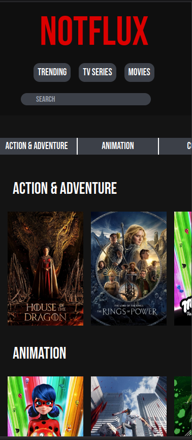

# **NOTFLUX**
## Link to the actual site
[Notflux](https://relaxed-truffle-a48eee.netlify.app/) 

## **Which is kind of a *Netflix* but not really**

* maybe that's why it's named **NOTFLUX** 

## **What have I used ?**

+ [**React**](https://beta.reactjs.org/)
     
+ [**React-router**](https://reactrouter.com/en/main)
   
+ [**Axios**](https://axios-http.com/docs/intro)
  
+ [**Tailwind**](https://tailwindcss.com/docs/installation)

+ [**TMDB**](https://developers.themoviedb.org/3/getting-started/introduction)

## **What was the purpose of this project ?**

1) To learn the React basics and learn how to create custom hooks to fecth data and display them properly .
   
2) To learn and mess around with React Router.Even if I think, I could have made a better usage of this amazing tool.
   
3) To learn and discorver Tailwind, which intrigued me a lot.
    
## **What can you do on this site ?**

+ See what tv series and movies are in the trending ( daily update )  
+ Search for a specific title in the search
+ Search a movie or a serie with a specific genre
+ You can find some information about the movie that clicked on and see a trailer of it
+ You can also find similar movies of the one you clicked on

## **Here are some screenshots to give you an Idea of what it looks like**

 

 

[**If you want to check it here is the Link**](https://relaxed-truffle-a48eee.netlify.app/) : 
* https://relaxed-truffle-a48eee.netlify.app/